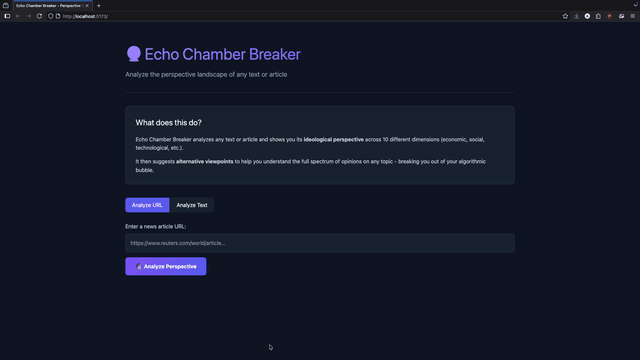

# 🔮 Echo Chamber Breaker

<div align="center">

[](https://opensource.org/licenses/MIT)
[](https://www.python.org/downloads/)
[](https://reactjs.org/)
[](https://fastapi.tiangolo.com/)

**Break free from your algorithmic bubble. See the perspectives you're missing.**

[Demo](#-demo) • [Features](#-features) • [Installation](#-installation) • [How It Works](#-how-it-works) • [Contributing](#-contributing)

</div>

---

## 🎯 What is Echo Chamber Breaker?

Echo Chamber Breaker is an AI-powered tool that analyzes any text or article to reveal its underlying ideological perspective. Unlike traditional sentiment analysis, it maps content across **10 distinct ideological dimensions** and suggests alternative viewpoints to help you break free from algorithmic bubbles.

### The Problem
- Social media algorithms optimize for engagement, creating filter bubbles
- We consume information that confirms our existing beliefs
- We're unaware of our own echo chambers
- Polarization increases as perspectives diverge

### Our Solution
- **Make the invisible visible**: Show the ideological landscape of any content
- **Suggest alternatives**: Curate diverse perspectives on the same topic
- **Track your diet**: Monitor your information consumption patterns
- **Stay private**: All analysis happens locally, we don't store your data

---

## 🚀 Demo

<div align="center">
  
</div>

### Try it yourself:

1. **Analyze a URL**: Paste any news article URL
2. **Analyze text**: Paste any paragraph or statement
3. **See the landscape**: View a radar chart of 10 ideological dimensions
4. **Discover alternatives**: Get curated links to different perspectives

---

## ✨ Features

### 🧠 AI-Powered Perspective Analysis
- **Zero-shot classification** using Facebook's BART-large-mnli model
- **10 ideological dimensions** covering economic, social, and technological perspectives
- **Confidence scoring** for transparency
- **Source credibility assessment**

### 📊 Interactive Visualizations
- **Radar chart** showing multi-dimensional perspective alignment
- **Bar charts** for dimension-by-dimension breakdown
- **Alternative viewpoint cards** with curated content

### 🔒 Privacy-First Architecture
- **Local processing**: Text analysis happens on your machine
- **No user accounts required**
- **No browsing history stored**
- **Open source**: Audit our code anytime

### 🌐 Browser Extension (Coming Soon)
- Real-time perspective analysis while browsing
- Gentle nudges when entering echo chambers
- Perspective diversity tracking over time

---

## 📦 Installation

### Prerequisites
- Python 3.9+
- Node.js 18+
- pip
- npm or yarn

### Quick Start

#### 1. Clone the Repository
```bash
git clone https://github.com/yourusername/echo-chamber-breaker.git
cd echo-chamber-breaker
```

#### 2. Backend Setup

```bash
cd backend

# Create virtual environment
python -m venv venv

# Activate (Windows)
venv\Scripts\activate
# Activate (Mac/Linux)
source venv/bin/activate

# Install dependencies
pip install -r requirements.txt

# Start the server
uvicorn main:app --reload
```

The backend will run on http://localhost:8000

#### 3. Frontend Setup

```bash
# Open a new terminal
cd frontend

# Install dependencies
npm install

# Start the development server
npm run dev
```

The frontend will run on http://localhost:5173 

#### 4. Open the App

Navigate to http://localhost:5173 in your browser.

### Docker Setup (Alternative)

```bash
docker-compose up --build
```

---

## 🔬 How It Works

### The Analysis Pipeline

```
User Input (URL/Text)
        ↓
   Text Extraction
   (BeautifulSoup)
        ↓
   Zero-Shot Classification
   (BART-large-mnli)
        ↓
   Multi-Dimensional Scoring
   (10 ideological axes)
        ↓
   Alternative Viewpoint Generation
        ↓
   Interactive Visualization
```

### Ideological Dimensions

We analyze content across 10 carefully selected dimensions:


| Dimension             | Measures                                                         |
|----------------------:|------------------------------------------------------------------|
| Economic Conservative | Free-market preference; low regulation; fiscal conservatism      |
| Economic Progressive  | Wealth redistribution; worker rights; government intervention    |
| Social Conservative   | Traditional values; institutional preservation                   |
| Social Progressive    | Social change; individual rights expansion                       |
| Libertarian           | Minimal government; emphasis on personal freedom                 |
| Environmentalist      | Ecological concern; sustainability focus                         |
| Techno-Optimist       | Technology as solution; enthusiasm for innovation                |
| Techno-Skeptic       | Criticism of technology; precautionary principle                 |
| Globalist             | International cooperation; cosmopolitan outlook                  |
| Nationalist           | National sovereignty; prioritizing local interests               |


## Model Details

We use facebook/bart-large-mnli:

- Architecture: Bidirectional and Auto-Regressive Transformer

- Size: 1.6GB, 406M parameters

- Training: Fine-tuned on MultiNLI (433k sentence pairs)

- Capability: Natural Language Inference (NLI)

- Zero-shot: Can classify without task-specific training

----


## 🛠️ Tech Stack 

### Backend

- FastAPI: High-performance Python web framework

- Transformers: Hugging Face's state-of-the-art NLP library

- PyTorch: Deep learning framework

- BeautifulSoup4: HTML parsing and text extraction

- scikit-learn: Machine learning utilities

### Frontend

- React 18: UI framework

- Vite: Build tool and dev server

- D3.js: Data visualization library

- Tailwind CSS: Utility-first styling

- Lucide React: Icon library

### Deployment

- Docker: Containerization

- Docker Compose: Multi-container orchestration

- Vercel/Netlify: Frontend hosting options

- Railway/Render: Backend hosting options

---

## 📁 Project Structure

```
echo-chamber-breaker/
├── backend/
│   ├── main.py              # FastAPI application
│   ├── requirements.txt     # Python dependencies
│   └── README.md            # Backend documentation
├── frontend/
│   ├── src/
│   │   ├── App.jsx          # Main React component
│   │   ├── components/      # React components
│   │   │   ├── PerspectiveRadar.jsx
│   │   │   ├── CredibilityMeter.jsx
│   │   │   └── AlternativeViewpoints.jsx
│   │   └── index.css        # Global styles
│   ├── package.json         # Node dependencies
│   └── vite.config.js       # Vite configuration
├── docker-compose.yml       # Docker orchestration
├── .gitignore              # Git ignore rules
├── LICENSE                 # MIT License
└── README.md               # This file
```

## 🤝 Contributing

We welcome contributions! Here's how you can help:

### Ways to Contribute

- 🐛 Report bugs: Open an issue with detailed reproduction steps

- 💡 Suggest features: Share ideas for new dimensions or features

- 📝 Improve docs: Fix typos, add examples, clarify explanations

- 🔧 Submit PRs: Fix bugs or implement features

- 🌍 Translate: Help make the UI multilingual

- 🧪 Test: Try the tool and provide feedback

## Development Setup

```bash
# Fork and clone the repository
git clone https://github.com/xelasaed-crypto/echo-chamber-breaker.git
cd echo-chamber-breaker

# Create a feature branch
git checkout -b feature/amazing-feature

# Make your changes and commit
git add .
git commit -m "Add amazing feature"

# Push and create a Pull Request
git push origin feature/amazing-feature
```

## Code Style
- Python: Follow PEP 8
- JavaScript: Use Prettier with default settings
- Commit messages: Use conventional commits format

---

## 🚧 Roadmap
### v0.2 (Current)

- Basic URL/text analysis
- 10-dimensional perspective mapping
- Alternative viewpoint suggestions
- Source credibility scoring

### v0.3 (Next)

- Browser extension (Chrome/Firefox)
- Personal perspective tracking
- Historical analysis of information diet
- NewsAPI integration for real alternative articles

### v0.4 (Future)

- Multi-language support
- Custom perspective dimensions
- Community-contributed viewpoint library
- API for third-party integrations

### v1.0 (Vision)

- Mobile app
- Research partnership program
- Real-time debate analysis

---

## 📊 Performance
| Metric	| Value |
|-----------|----------------|
|First analysis time |	10-30s (model download) |
| Subsequent analyses |	2-5s |
| Max text length	| 3000 characters |
| Memory usage	| ~2GB RAM |
|Model size	 | 1.6GB |


---

## 🔒 Privacy & Ethics
### Our Commitments

- No tracking: We don't use analytics or cookies
- No storage: Text is processed and discarded
- Open source: Full transparency
- No manipulation: We don't try to change your views

### Ethical Guidelines

- Never surface conspiracy theories or disinformation
- Sources must meet minimum credibility thresholds
- Not designed to change minds, only expand understanding
- Methodology is fully auditable

---

## ❓ FAQ

**Q: Does this work for non-English text?**
A: Currently, the model is trained primarily on English. Multi-language support is on the roadmap.

**Q: How accurate is the analysis?**
A: The BART model achieves ~90% accuracy on NLI tasks. However, ideological classification is inherently subjective. Use as a guide, not absolute truth.

**Q: Is my data safe?**
A: Yes! All analysis happens locally. We never send your text to external servers (except when fetching URLs you provide).

**Q: Can I add my own perspective dimensions?**
A: Yes! Edit the PERSPECTIVE_DIMENSIONS list in backend/main.py. The zero-shot model will adapt automatically.

**Q: Why does the first analysis take so long?**
A: The BART model (~1.6GB) downloads on first use. Subsequent analyses are much faster.

---

## 📜 License

This project is licensed under the MIT License - see the LICENSE file for details.

MIT License means:

- ✅ Commercial use
- ✅ Modification
- ✅ Distribution
- ✅ Private use
- ❌ Liability
- ❌ Warranty

---

## 🙏 Acknowledgments

- Hugging Face for the Transformers library and BART model
- Facebook AI Research for training BART on MultiNLI
- The open-source community for countless tools and libraries
- All contributors who help improve this project

---

## 📞 Contact & Support

- Issues: GitHub Issues
- Discussions: GitHub Discussions
- Email: xela.saed@gmail.com
